# 交易学习记录

## 日常记录区（两周一清）

- k线只有两种 **趋势k线和非趋势k线**，趋势k线就是那种实体很长，影线很短的k线，表示多空某方力量完全控制了这个k线，反之则为非趋势k线。（过长的趋势k线也可能是能量耗尽的表现，前面接交易区间，然后接过长的趋势k线可能出现？）

- 连续急速，不重叠的趋势k线表示行情方向。而非趋势k线则表达了市场的犹豫，不确定。

- 非趋势k线的组合也可以呈方向性运动；趋势k线相互重叠，也会形成交易区间。

  

## 聪明钱不会在市场第一次触底或触顶入场，必须要多次回测，查看多空双方的力量。

聪明钱不会和市场较劲，但发现判断错误应该立刻止损出场。

## 趋势调整末期正是追随主力进入趋势的最好机会。

趋势k线在交易区间和急速行情中代表的意义不一样。当有明确的阻力位或者是交易区间时，多方出现明确的趋势走向有可能是因为此时市场中缺少空方，空方则是在阻力位等待，而不是在交易中部。

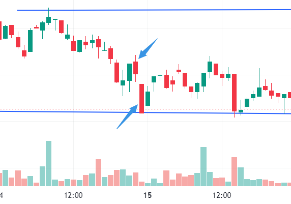

## 如果区间没有明确被突破，应当一直进行区间交易，而不是做突破交易。

## 汇总记录区

### k线形态认识

- 反转k线：该k线与前一根k线重叠较少，且和旧趋势相反，影线较长，其后一根k线是强入场k线。重要的是它的背景让他成为反转k线，而不是说它本身的形态。（多用在回调减仓，最好不要 **逆趋势**）

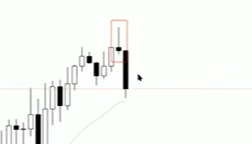

- 双k线反转：两根连续的趋势k线，长度大致相等，但是方向相反。（小周期的双k线反转，就是大周期的单k线反转）

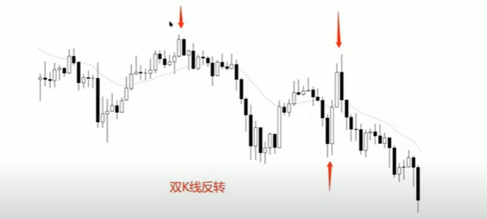

- 内包k线：两个连续的k线中，前一根的范围包住了后一根。下图这种内包k线可以验证水平阻力位，如果出现趋势k线，可以验证行情趋势方向。

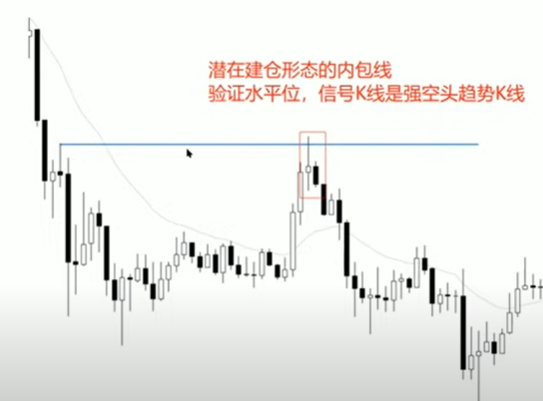

- 外包k线，外包k线大多无意义，表示交易区间。要看质量，最好是假突破验证水平阻力位，同时有强势的趋势实体（**不要逆趋势**），可以作为入场信号。

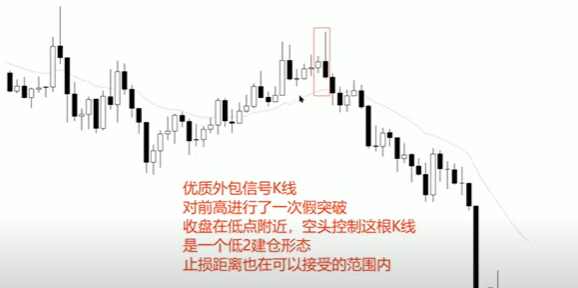

- 铁丝网形态：3根或更多根大部分重叠的k线形态，表明市场的犹豫。（如果没有对支撑位进行多次验证，那趋势确实不能确定）

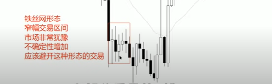

- **二次突破形态**：在回调过程中，出现两次后一根k线突破前一根k线的情况，突破方向和大趋势保持一致。且在小周期上会形成双重顶底。

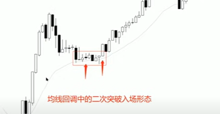

用我最近的一次交易举例，回调中的二次突破形成双重顶底。

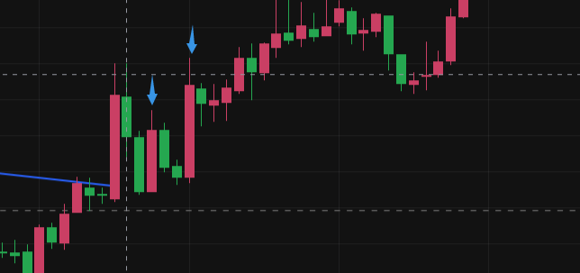

### 回调的形态

（所有非趋势形态都是回调）

#### 简单回调

价格明确的 **强势运动**（不是趋势通道），之后进行了一次短暂的回调，而且这次回调没有太多重叠的部分，之后回调力量减弱。

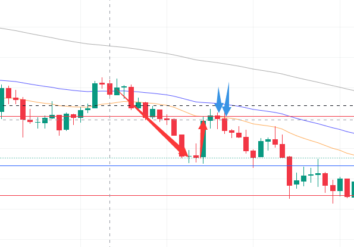

如上图一样，回调末期出现原趋势信号。如果是强趋势的话比如单k线反转，外包k线，这种信号可以入场，比如下面这个很长的实体，几乎没有影线，而且前面的上涨已经出现发力，这根k线收盘可以入场，继续往后等，可能止损位太远了。

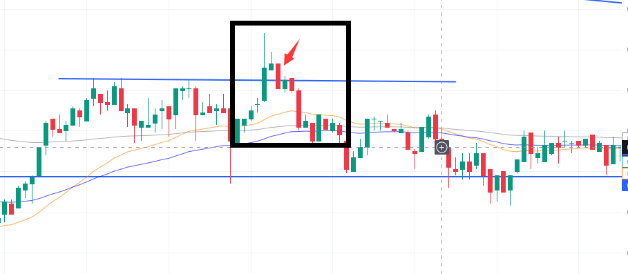

比较稳妥的做法像图一一样，等二次突破，等第二个蓝色箭头的那根k线下跌超过前根k线最低点时入场，盈亏比也能有一点几。

#### 复杂回调

-  两段式回调

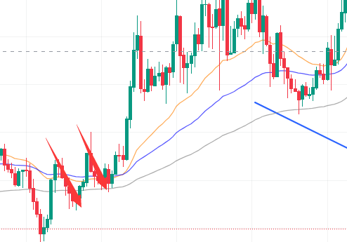

-  三段式回调

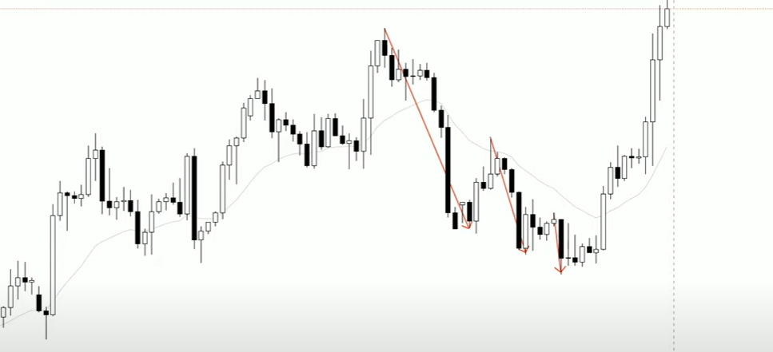

这种一般在最后一段调整末期，根据入场信号入场，看空看多，尽量与原大趋势一致。

- 旗形调整

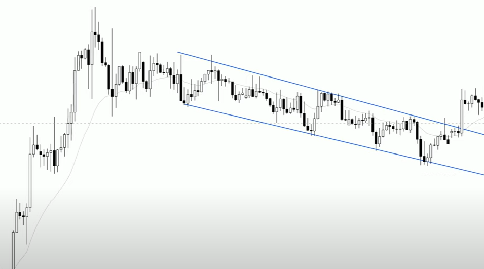

一段趋势之后出现的通道线回调，一般突破做多。

- 收敛形态

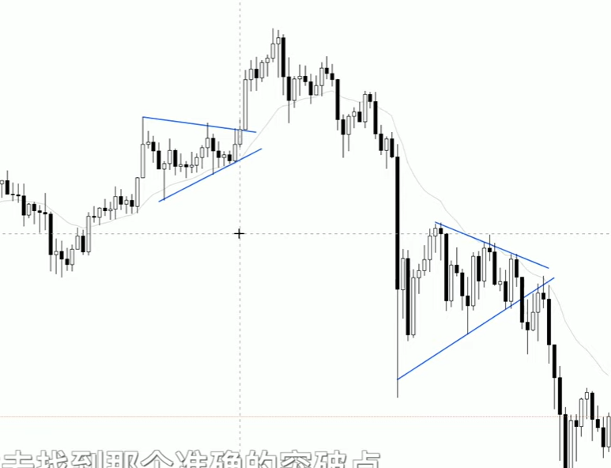

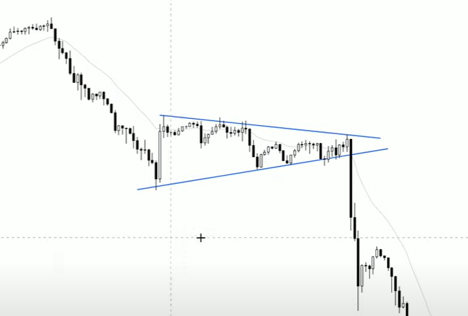

比较难交易

- 箱体回调

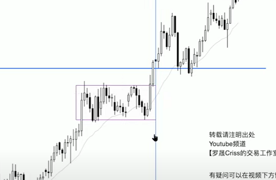