# 交易记录

## 2024/01/21

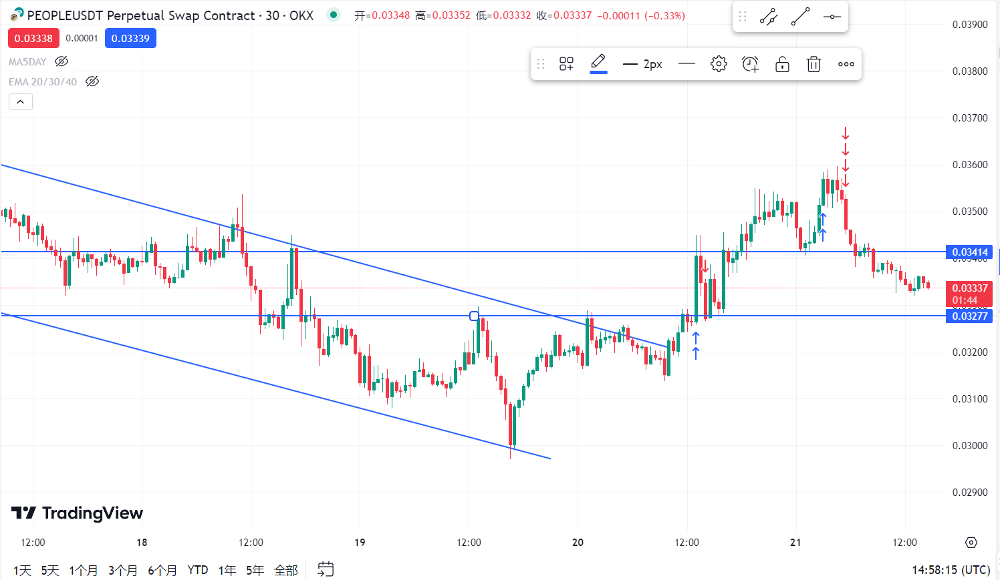

具体怎么买的，买的看多还是看空已经忘记了。第一次买入来看，突破前面多次验证的阻力位，有一次急速上涨，但是当时买入的价格是0.3398，也就是已经上涨接近了上面的阻力位。这个时候其实不应该买入了。因为此时设置止损止盈位的话，止损位至少得设置在0.03277下一点，止盈位由于还没有完成对第二条阻力位的突破的话，无法设置很高的止盈，即使是设置在0.035附近作为止盈的话，盈亏比也不高。总之，不该入场（而且，这才是第一次反弹触顶，聪明资金不会在第一次触顶就入场的）。

第二次买入是看多。此时认为前段是一段急速上涨然后急速下跌的简单回调，然后出现第二根绿线，第四根绿线的高点分别超过前根k线高点，二高进场。但是这次的进场点实际是在二高的后一根k线进场的，而且买入价格达到0.3545，其实也没啥问题，这个价格超越前个波段高点，然后我入场更稳妥，只是下一根红线出现的时候，然后又出现一根绿线，这几根线大幅重合形成交易区间，其实小周期上看可以看到是一个二重顶，感觉是突破失败，趋势要反转了。（在大周期上，行情趋势实际上还是下跌的，看空实际是一种逆趋势）感觉操作没啥问题，可能运气不好。

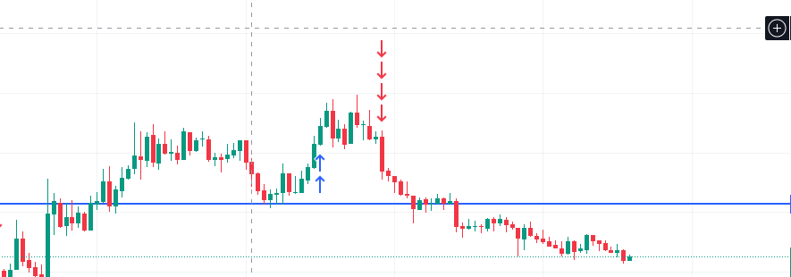

## 2024/01/22

- 入场形态：回踩EMA20均线；达到下跌趋势通道线；简单回调“高二” **做空**
- 盈利：14.58u（28%）
- 计划盈亏比：2   实际盈亏比：0.725 操作：提前止损，如果不修改可以止盈。

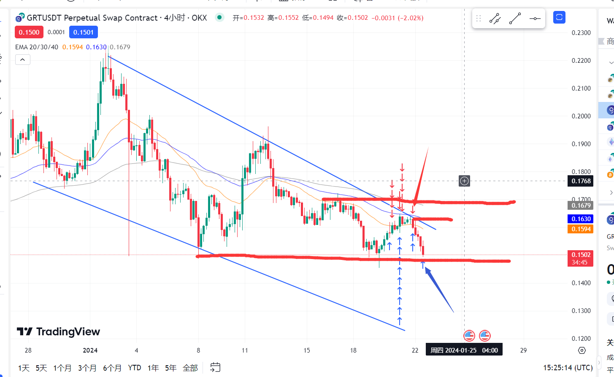

这笔交易我几乎用到了几乎全部的知识，红色大箭头是我的入场时间，蓝色大箭头是我的卖出时间，下面是我的分析过程:

首先4小时图上看这是个下跌趋势，而入场前正是处于回调中，这是有机会做空的。

然后查看EMA曲线，查看推动级别，4小时周期上会发现是在EMA30这个线上（30/60/120，别看title，忘记改了）。每每靠近EMA30的时候就会下跌，而当前的位置已经穿过了EMA30，靠近了60线，如果趋势真的向下，入场机会很快就回来。并且根据趋势通道划线来看，入场前的点位也很接近阻力通道线了。

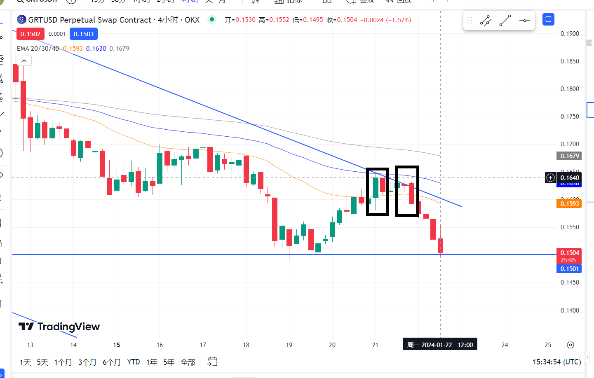

然后寻找入场信号，左边的框框，压力线的第一次验证，右边的框框的三根k线，阻力位第二验证，并且依次出现“高一”，“高二”（当时即将出现），而且第三根k线有巨大的实体，且接近可以看成一根外包k线（在8小时图上可能就是一根带强趋势实体的外包k线）且实体趋势和大趋势一致。总总现象表明，现在必须要入场了，不能等第三次验证。

入场选择，等该k线跌破前一根红色十字星最低价时入场，止损位，止盈位选择如第一张图。具体数据是：止盈：0.1470（最低的绿k线上一点点），止损：0.1657（当前波段高点），买入价：0.1595，盈亏比：20。（止盈，止损没设置好）还要研究。止损应该放在压力位远离成本处，这样可以防止假突破，亏钱下车。止盈位应该放在压力位靠近成本价，这样防止压力位估算不准，又回调损失利润。

## 2024/01/24

入场形态：接近下跌趋势通道线；盈亏比可以设置很好；通道中的强势下跌认为能量不足； **做多**

盈利：23u（33.46%）

计划盈亏比：1.58  实际盈亏比：0.78 原因：提前止盈，按计划是可以止盈的。

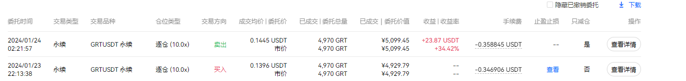

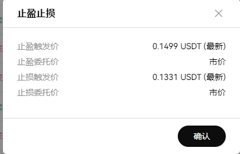

这一单一开始预设的盈亏比差不多1.5左右，但是最后并不是止盈收的，我又是提前平仓了。感觉操作不太合理。

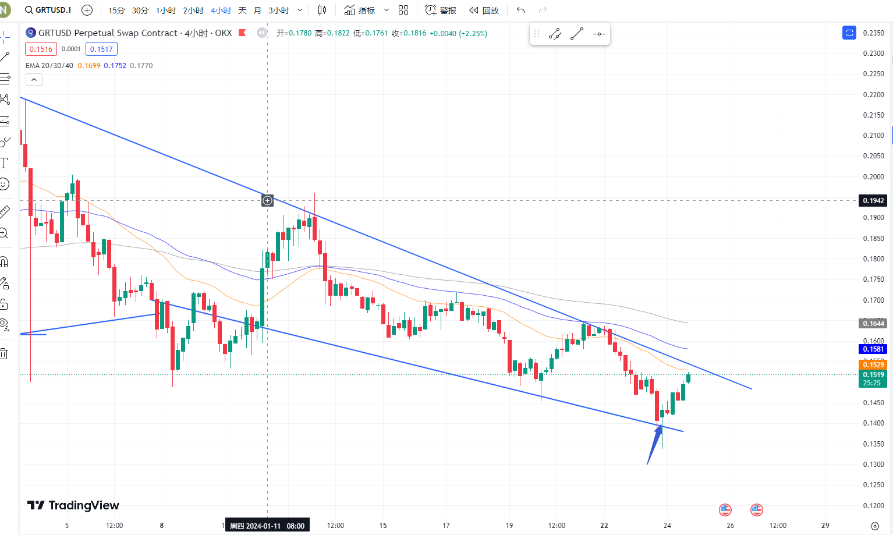

蓝色箭头是我的入场点位，首先看趋势，这是一个向下的趋势，而且在经历急速下跌的过程之后，回调变成了下跌通道。而且在0.1519这个价位，形成了很强的支撑，可以看到前四次想要跌破这个支撑位，都失败了。其实入场的时候的位置应该是买空，买多都可以。根据视频将的，如果买空的话，就是要看能不能强势突破通道线，但是很容易形成假突破。换到30分钟小周期来看

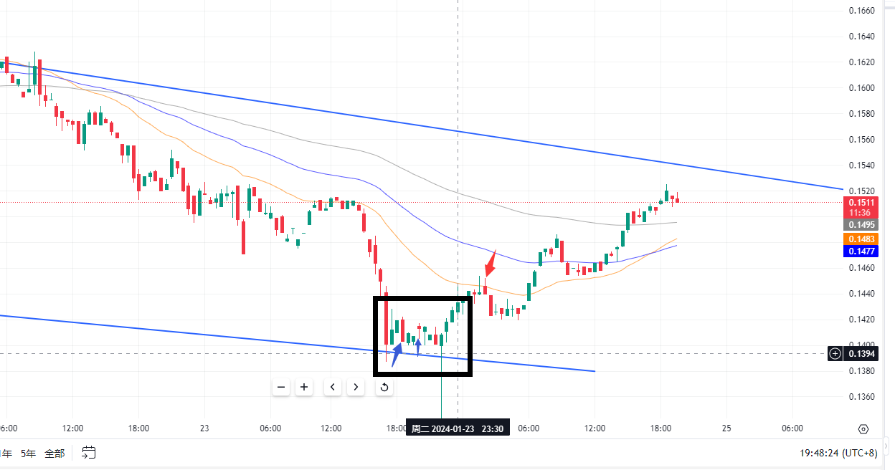

这里已经形成了“高二”，所以我还是选择做多（通道线内的急速下跌，很有可能是能量不足），止损设置在通道小下方多一点，止盈设置在前方波段高点0.1511下方一点。然后半夜突然惊醒，在红色箭头那个位置，前面的绿线出现长影线，此时还正处于下跌，因此我决定平仓（是在不想看了，半夜两点，其实可以保本止损，现在来看，那个位置是一次简单回调，也应该至少验证阻力位两次之后再平仓，哎！）

## 2024/01/25

入场形态：急速拉升，对阻力位的假突破，出现长上影线，**做空**

盈利：32u（28%）

计划盈亏比：1.79  实际盈亏比：1.4 原因：涨了一半卖了一半。

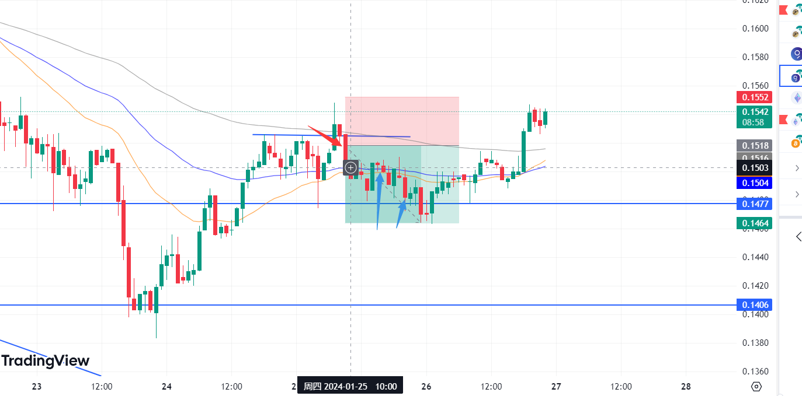

其实这里入场的时候已经简单形成了一个交易区间，前两次测试都没有形成突破，也应该趋向于相信这个潜在交易区间，所以等到第二根红线低于第一根红线收盘价，而且刚好是阻力位的时候入场。其实，现在来看止盈位设置的有点远，按照这里的交易区间来看应该设置在前一个波段点上一点点，那我选择的入场点位就有问题了。只是说他刚好下破，形成了一个更宽的交易区间，然后我盈利还可以。

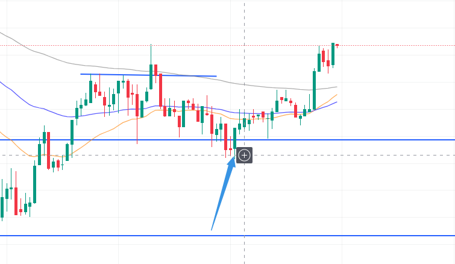

实际上这一段最好的入场位一个在上面这张图的箭头处，前面出现大阴线，然后十字星，然后大阳线，而且大阳线是个外包线，多头趋势强劲。这三个线一看，小周期就是二重底，这个时候入场肯定是非常好的，只不过这个时候太晚了，晚上12.30左右，所以没能入场。这个盈亏比也很可观，止损设置在下影线下一点，止盈可以设置到区间顶部下一点。哎，操。

## 2024/02/03

有一段时间没有记录了，虽然没记录在这里，但是天天在交易，都在excel上进行数据记录，和简要的心得记录。今天这次记录是因为遭受到一次巨额亏损，而发生的原因我觉的是这段时间的心态导致的。其实很早就感觉心态已经很浮躁了，不是说自己交易得太频繁了什么，而是说很多入场行为已经变成了一种心里暗示：**第一眼不是去判断背景，判断趋势，而是想去找大盈亏比（因为大盈亏比才有入场理由），然后再利用几个风险较高的信号去说服自己立刻买入这个大盈亏比的趋势方向。**对我这种新手来说，主观性地大盈亏比入场，这种低胜率入场方式带来的后果是我心里不太能承受的。最明显的区别就是，在交易初期，我的胜率是很高的，因为我了解的大都是一些高胜率的入场方式，而学习稍微深入之后，则变得贪婪，被大盈亏比吸引，然而很多时候大盈亏比的出现是自己设置的不合理产生的（有很多单被打掉止损）。涨少跌多下来，终于是在今天遭受重创，一天亏了近一千。虽然对于金额来说，我能够接受，但是我感觉对于这段时间的心态，入场方式，学习到的知识必须尽快做一个总结，不然过完年亏完5000应该不是没有可能。

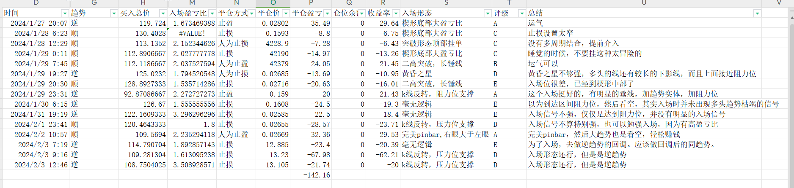

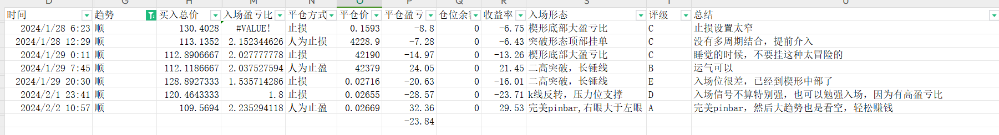

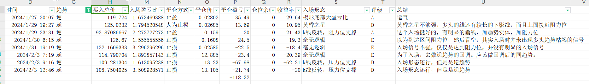

虽然逆势的趋势产生的大幅亏损主要是因为今天的操作造成的，而且如果把今天的两笔亏损去掉，其实逆势的胜率和亏损都是小于顺势的，但是逆势的操作中后面的评价在复盘看来大多都是有问题，而且评价很低，没有逻辑支撑。由于样本量较小，所以看着顺势操作的表现并没有好过逆势操作。

下面我挑几个重点的操作去复盘一下。

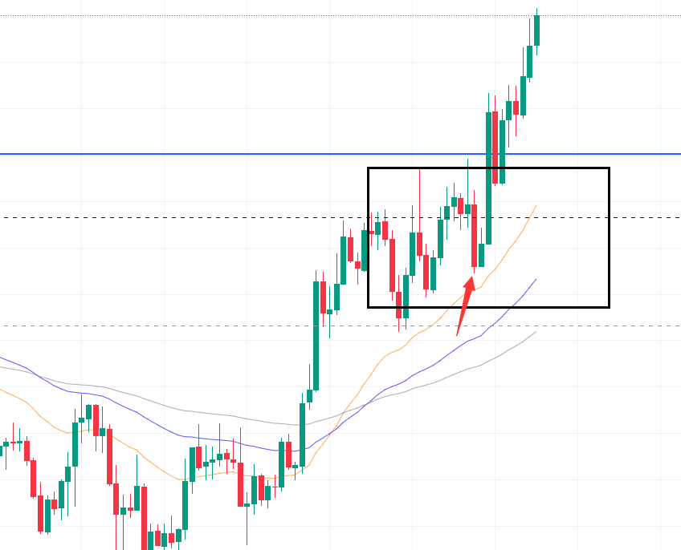

**这个交易是我亏损最大那一笔-68u。盈亏比有1.6，止盈在楔形通道的起点，止损在蓝线**。这个图其实出现了很不错的入场pinbar信号，而且有一个长的看空趋势k线，我是趋势k线中入场的，因为这个pinbar其实已经是假突破了，所以我觉得这里想做空也是合理的。**但是错就错在如果是逆趋势的话，你不能把这个看成反转，最多只能看成回调，而且结合前面的走势，这已经是一个楔形通道了。新手逆势的止盈设置最好还是按照回调来设置，不要去按照反转。**我把止盈设置在了前一个地点，所以没达到我的止盈，然后又亏回去了，因为他走得是一个斜的通道。

如果下次要交易要怎么交易呢？**这种楔形末端的我只交易趋势延续，也就是在趋势线下方挂单看多，止损设置在上一个低点（定死），止盈设置在压力位靠下（灵活）。盈亏比太小不做（通过窄损来提高盈亏比，往往只会被打掉止损，一定要有逻辑支持）。**

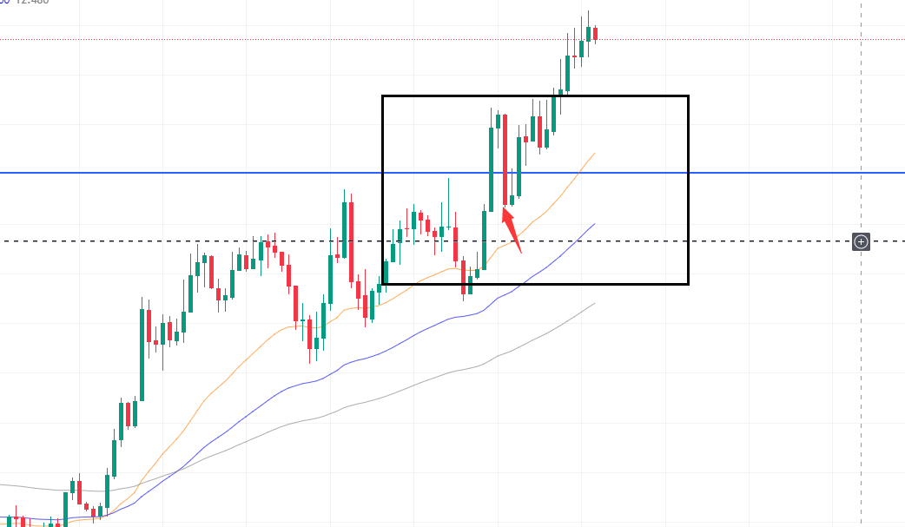

这笔交易是突破之后回测了阻力位（支阻互换），后面的走势其实也不能确定，这条k线走完的时候其实是有一些盈利的，并且盈亏比也可以设置的很好，但是这实际是一种左侧交易，因为前根k线有较长的下影线，而没有上影线，没有表现出多空的激烈互博，更没有表现出空头处于强势，所以这根k线入场，有高盈亏比，但胜率很低，而且还是逆趋势，胜率更低了。